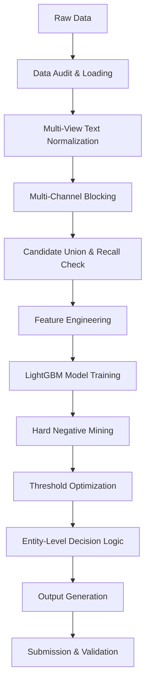

# Amazon ML Challenge 2026 — Business Entity Resolution

## 1. Project Overview
This repository contains the complete, end-to-end solution for the Amazon ML Challenge 2026: Business Entity Resolution. The system is designed to resolve and match business entities across three diverse data sources containing noisy, abbreviated, and inconsistent names and addresses spanning multiple countries.

## 2. Problem Statement
Given a reference set of business records (Source 1), the goal is to identify all matching records from Sources 2 and 3 that correspond to the same real-world entity. 
- Source 1 is the reference/master source.
- Each Source 1 entity may have zero, one, or multiple matches in Sources 2 and 3.
- Business records include names, addresses, and countries (e.g., US, India, France).

## 3. Competition Objective and Evaluation Metric
The primary objective is to maximize the macro-averaged entity-level **F0.5** score. 
The F0.5 metric weights precision four times more than recall. 
```
F_0.5 = (1 + 0.25) * P * R / (0.25 * P + R)
```
The evaluation operates at the entity level, meaning predictions are evaluated per Source 1 entity and then macro-averaged.

## 4. Repository Structure
```
Amazon_Ml_challenge/
├── code/
│   └── business_entity_resolution/
│       ├── configs/
│       │   └── default.yaml       # Central configuration file
│       ├── src/
│       │   ├── data.py            # Data loading & audit
│       │   ├── normalization.py   # Multi-view text normalization
│       │   ├── blocking.py        # Multi-channel candidate generation
│       │   ├── features.py        # Pairwise feature engineering
│       │   ├── training.py        # LightGBM training + hard negatives
│       │   ├── evaluation.py      # Entity-level F0.5 evaluation
│       │   ├── inference.py       # Test inference pipeline
│       │   ├── decision.py        # Entity-level decision policy
│       │   ├── submission.py      # Output generation & validation
│       │   └── main.py            # Master orchestrator
│       ├── experiments/
│       │   └── results.csv        # Auto-generated experiment logs
│       ├── models/                # Saved models and engines
│       ├── logs/                  # Pipeline execution logs
│       ├── submissions/           # Versioned submission archives
│       ├── requirements.txt
│       └── README.md              # Original sub-directory README
├── dataset/
│   ├── train/
│   └── test/
├── output/
│   ├── matching_results.tsv
│   └── candidate_pairs.tsv
├── utils/
│   └── validate_submission.py     # Official competition validator
├── Documentation_template.md
└── RESULTS.md                     # Actual experimental results
```

## 5. End-to-End Architecture and Data Flow


## 6. Role and Responsibility of Every Important Python Module
- **`main.py`**: The master orchestrator that connects all components and handles `--phase` arguments (`all`, `train`, `infer`).
- **`data.py`**: Handles fast loading of TSVs, data auditing (missing values, distributions), and ground-truth parsing.
- **`normalization.py`**: Executes the multi-view text normalization pipeline (11 name views, 14 address views).
- **`blocking.py`**: Implements the 8-channel inverted index and TF-IDF similarity to generate candidate pairs.
- **`features.py`**: Computes ~60 pairwise similarity features (e.g., Levenshtein, Jaro-Winkler, TF-IDF cosine) between candidates.
- **`training.py`**: Manages LightGBM training, GroupKFold cross-validation, and hard-negative mining iterations.
- **`evaluation.py`**: Calculates the strict macro-averaged entity-level F0.5 score exactly as defined by the competition.
- **`decision.py`**: Applies optimized thresholds, entity-level gating, and score margins to finalize match decisions.
- **`inference.py`**: Runs the end-to-end inference pipeline on test data using saved models.
- **`submission.py`**: Formats output TSVs and archives runs into timestamped submission directories.

## 7. Dataset Structure and Expected Input Files
The system expects data to be placed in `dataset/train/` and `dataset/test/` with the following files:
- `train_source1.tsv`, `train_source2.tsv`, `train_source3.tsv`
- `train_ground_truth.tsv`
- `test_source1.tsv`, `test_source2.tsv`, `test_source3.tsv`

## 8. Installation and Dependencies
To install the required dependencies:
```bash
cd code/business_entity_resolution
pip install -r requirements.txt
```
**Key Dependencies**:
- `lightgbm` (>=3.3.0) - Core classifier
- `rapidfuzz` (>=3.0.0) - Fast string matching
- `pandas`, `numpy`, `scipy`, `scikit-learn`, `xgboost`, `pyyaml`, `tqdm`

## 9. Configuration
The central configuration file is located at `code/business_entity_resolution/configs/default.yaml`.
It controls data paths, normalization rules (legal suffixes, address expansions), blocking limits (`tfidf_top_k: 40`), feature flags, training parameters, LightGBM hyperparameters, and decision thresholds.

## 10. Data Loading and Auditing
Implemented in `data.py`. The system loads records, handles nulls gracefully, and computes data distributions. Missing fields are preserved as indicators rather than imputed, as absence of data is a valid signal.

## 11. Text/Name/Address Normalization
Implemented in `normalization.py`. 
- **Names**: 11 normalized views (e.g., Unicode NFKD, diacritics-removed, punctuation normalized, alphanumeric, tokenized, sorted tokens, legal suffixes stripped).
- **Addresses**: 14+ views including abbreviation expansion (e.g., "rd" -> "road"), structural extractions (first numeric for house number, postal code candidates).
- **Countries**: Lowercased and diacritics-removed (no country-specific hardcoding).

## 12. Candidate Generation and Blocking
Implemented in `blocking.py`.
The system uses an 8-channel inverted index approach to avoid exhaustive O(N^2) comparisons.
Channels include exact name, stripped name, postal code, house number + prefix, and IDF-filtered tokens. It generates a union of candidates and caps at `top_k=40` per S1 entity. 
*Actual Performance*: 99.2% reduction in search space while maintaining 0.9427 candidate recall.

## 13. Feature Engineering
Implemented in `features.py`. Computes ~60 pairwise features:
- **Name**: Length ratio, Levenshtein, Jaro-Winkler, Token sort/set ratios, TF-IDF cosine.
- **Address**: Token overlap, numeric token Jaccard, house number match.
- **Other**: Country matches, missingness indicators, cross-field combined features, and blocking channel counts.
*Note: `name_length_ratio` is the most important feature based on LightGBM splits.*

## 14. Training Pair Construction
Implemented in `training.py`. 
- **Positives**: Sourced from ground-truth matches.
- **Negatives**: Sampled exclusively from the candidate pool generated by blocking, rather than the full Cartesian product, providing realistic negative examples.
The initial positive:negative ratio is configured via `random_negative_ratio`.

## 15. LightGBM Model Training
Implemented in `training.py`.
- **Backend**: LightGBM (`LGBMClassifier`) with GBDT.
- **Cross-Validation**: `GroupKFold` (5 folds) grouped by `source1_entity_id` to strictly prevent data leakage between train and validation.
- Evaluated configuration uses 441 trees, max_depth 7, and learning rate 0.05.

## 16. Validation Strategy
Implemented in `evaluation.py`.
Strictly computes macro F0.5 on held-out validation sets. Entities are never split across train and validation. Evaluates precision, recall, singleton accuracy, and multi-match F0.5.

## 17. Hard-Negative Mining
Implemented in `training.py`.
To drastically reduce false positives, the system performs a 2-pass hard negative mining.
The baseline model scores all non-match candidates. The highest-scoring false positives are injected back into the training set as "hard negatives", and the model is retrained.

## 18. Threshold Optimization
Implemented in `decision.py`.
The system performs a threshold sweep (e.g., 0.50 to 0.98) on the validation set to uniquely maximize macro F0.5. 
*Actual Results*: Selected default threshold of 0.650 (S2=0.750, S3=0.650) achieving a validation F0.5 of 0.9682.

## 19. Entity-Level Decision Logic
Implemented in `decision.py`.
- **Entity Gate**: If the max score for an S1 entity is below 0.40, empty prediction is output (singleton).
- **Margin Check**: If the gap between the top and second candidate is < 0.15, the threshold is raised by +0.10.
- Applies source-specific thresholds.

## 20. Test Inference
Implemented in `inference.py`.
Loads the best saved LightGBM model, runs test data through the exact same normalization, blocking, and feature engineering pipeline, applies the decision logic, and yields final predictions.

## 21. Output Files
The pipeline outputs to `output/`:
- `matching_results.tsv`: `source1_entity_id <TAB> matched_entity_ids`
- `candidate_pairs.tsv`: `source1_entity_id <TAB> candidate_entity_ids`

## 22. Official/Internal Validation
Implemented in `submission.py` and via the provided `utils/validate_submission.py`. Checks for duplicate IDs, invalid candidate pairs, and missing S1 entities.

## 23. Submission/Versioning
Implemented in `submission.py`. 
Each run is securely archived in `submissions/v_YYYYMMDD_HHMMSS/` containing the output TSVs and a `metadata.json` with configuration and metrics. Run metrics are appended to `experiments/results.csv`.

## 24. Reproducibility
The pipeline is deterministic. All random states are controlled via `random_seed: 42` in `configs/default.yaml` and passed through to LightGBM, Pandas, and negative sampling.

## 25. Quick-Start Commands
From the project root (`Amazon_Ml_challenge/`):
```bash
cd code/business_entity_resolution

# Run the full pipeline (train + infer)
python -m src.main --config configs/default.yaml --phase all

# Train only (saves model to models/)
python -m src.main --config configs/default.yaml --phase train

# Inference only (loads saved model and processes test data)
python -m src.main --config configs/default.yaml --phase infer

# Validate a submission
python ../../utils/validate_submission.py \
    --matching ../../output/matching_results.tsv \
    --candidate ../../output/candidate_pairs.tsv \
    --test-dir ../../dataset/test
```

## 26. AI / Parser Guide
To understand, modify, or extend the repository, an AI coding assistant should inspect the following files based on the objective:
- **Configuration & Hyperparameters**: `code/business_entity_resolution/configs/default.yaml`
- **Data Schemas & Loading**: `code/business_entity_resolution/src/data.py`
- **String Cleaning & Text Views**: `code/business_entity_resolution/src/normalization.py`
- **Index Generation & Recall**: `code/business_entity_resolution/src/blocking.py`
- **Adding New Features**: `code/business_entity_resolution/src/features.py` (Search for `def compute_features`)
- **Model Tuning & Data Leakage Prevention**: `code/business_entity_resolution/src/training.py`
- **Scoring & Metric Definition**: `code/business_entity_resolution/src/evaluation.py`
- **Prediction Logic & Thresholds**: `code/business_entity_resolution/src/decision.py`
- **Experimental Baselines & Metrics**: `RESULTS.md` and `Documentation_template.md`
